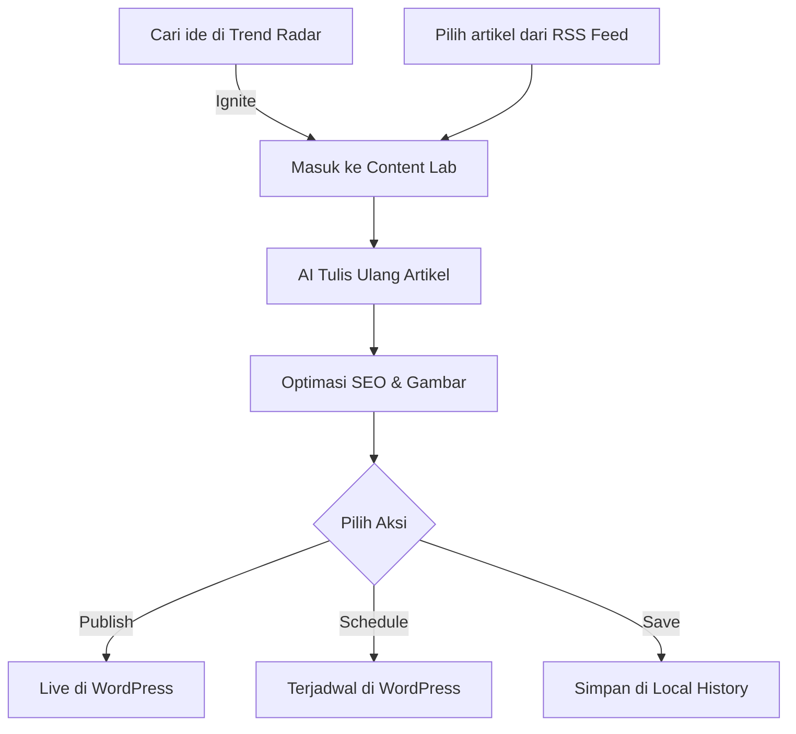

# User Flow & Workflows

Berikut adalah alur penggunaan utama di aplikasi Contently.

## 1. Onboarding & Setup
1.  **Registrasi**: User baru membuat akun (Email atau Google Login).
2.  **Koneksi Website**: User pergi ke menu **Integrations** untuk menyambungkan WordPress.
3.  **Setup RSS**: Menambahkan sumber RSS di menu **Web Sources**.

## 2. Workflow Produksi Artikel (Content Lab)

## 3. Workflow Carousel (Instagram Studio)
1.  **Input**: User memasukkan URL artikel berita.
2.  **Generate**: AI membuat Storyboard (teks per slide).
3.  **Refine**: User memilih preset style (warna/font) atau edit teks manual.
4.  **Export**: Menghasilkan file gambar zip untuk diupload ke Instagram.

## 4. Workflow Discovery (Trend Radar)
1.  **Search**: Mencari "AI Technology" di dashboard Trend Radar.
2.  **Evaluate**: AI memberikan skor "90/100 Viral Potential".
3.  **Action**: Klik "Ignite to Lab" untuk mulai menulis konten tentang tren tersebut.

---

## 🔐 Keamanan & Akses
-   **Role-Based Access**: User biasa hanya bisa mengakses fitur sesuai paket token mereka.
-   **Admin Access**: Digunakan untuk manajemen platform global dan monitoring sistem.
-   **Data Privacy**: Kredensial WordPress disimpan dengan enkripsi di database.
